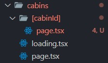
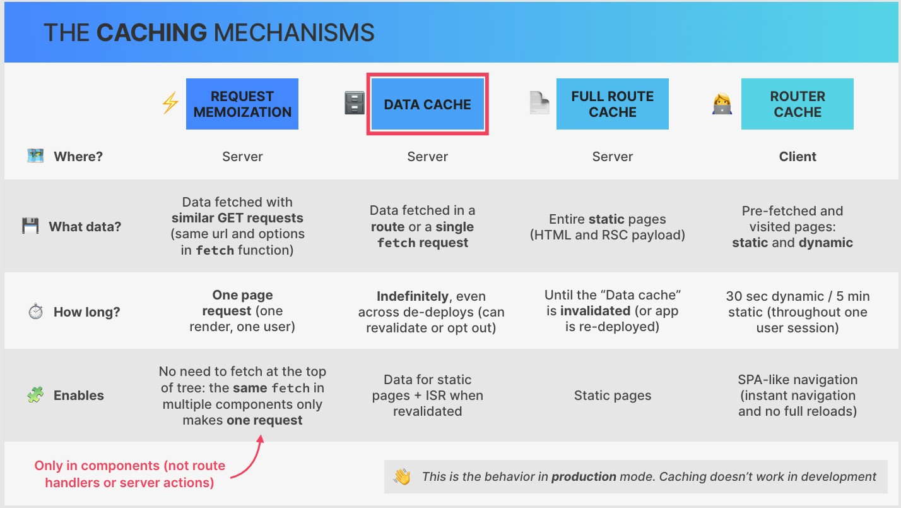
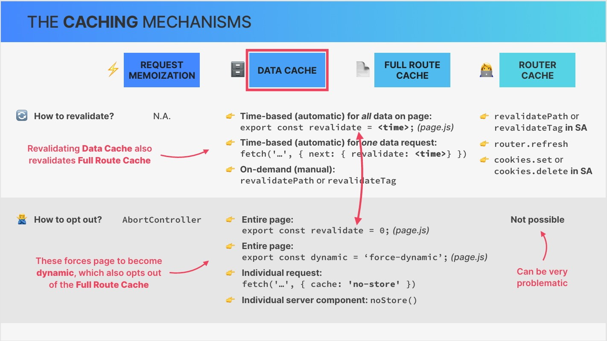
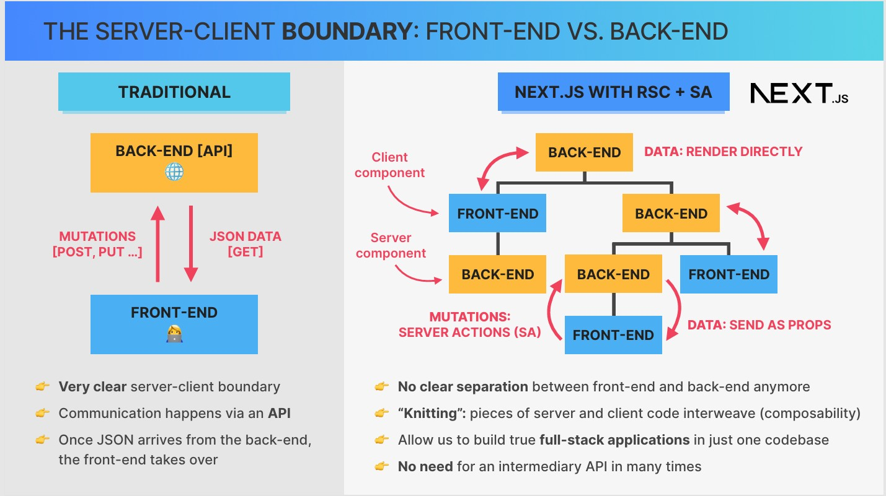
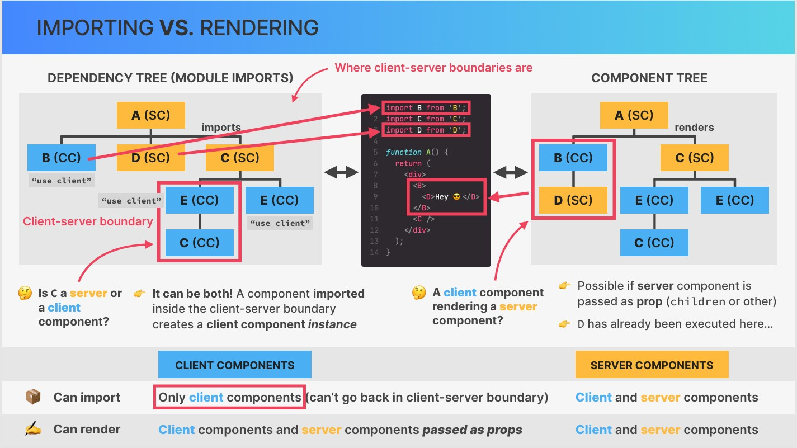

# Next JS


### How to install 
```
npx create-next-app@latest
```

### Adding meta data
``` tsx
export const metadata = {
    title: {
        template: '%s / The Wild Oasis',
        default: 'Welcome / The Wild Oasis',
    },
    description: '',
};
```

### Importing google fonts

``` tsx
import { Josefin_Sans } from 'next/font/google';

const josefin = Josefin_Sans({
    subsets: ['latin'],
    display: 'swap',
});

<div className={`flex flex-col bg-primary-950 text-primary-100 min-h-screen ${josefin.className}`}>
</div>

```

### How to show loading element

1. make a component for loading in the root you want
``` tsx
function Loading() {
    return <p>Loading data</p>;
}

export default Loading;
```

> [!TIP]
> If you do it in root folder it will apply for all your components

## Images in Next JS
### First Way:
``` tsx
import Image from 'next/image';

<Image src="/logo.png" height="60" width="60" alt="The Wild Oasis logo" />
```

### Second Way:
``` tsx
import logo from '@/public/logo.png';

 <Image
     src={bg}
     fill
     placeholder="blur"
     quality={80}
     className="object-top object-cover"
 />
```

> [!TIP]
> You can use quality

### Tric for images without size
``` tsx
   <div className="col-span-2 relative aspect-square">
        <Image fill src="/about-2.jpg" className="object-cover" alt="alt" />
   </div>

```

## Nested Layout

```
function Layout({ children }: { children: ReactNode }) {
    return (
        <div>
            // layout contetn
            <div>{children}</div>
        </div>
    );
}
```

## Data Fetching
```tsx
import { getCabins } from '../_lib/data-service';
const cabins: any = await getCabins();


export const getCabins = async function () {
  const agent = new https.Agent({
    rejectUnauthorized: false, // Allows self-signed certificates
  });
  const res = await fetch(`${API_URL}/get-cabins`, { agent });
  return res.json();
};

```

## Suspense

### Parent Component


```tsx
<Suspense fallback={<Spinner />}>
      <CabinList />
</Suspense>

```
### CabinList Component
```tsx
import { getCabins } from '../_lib/data-service';
import CabinCard from './CabinCard';

async function CabinList() {
    const cabins: any = await getCabins();

    if (!cabins.length) return <></>;

    return (
        <>
            {cabins.length > 0 && (
                <div className="grid sm:grid-cols-1 md:grid-cols-2 gap-8 lg:gap-12 xl:gap-14">
                    {cabins.map((cabin: any) => (
                        <CabinCard cabin={cabin} key={cabin.id} />
                    ))}
                </div>
            )}
        </>
    );
}

export default CabinList;
```

## Dynamic Routes
1. Make a folder with [id] template 



2. Link to it like bellow
   ```tsx
    <Link
         href={`/cabins/${id}`}>
         Details & reservation &rarr;
    </Link>
   ```
3. Get Params
```tsx
export default function Page({ params }: { params: any }) {
 const cabin = await getCabin(params.cabinId);
}
```
## Dynamic Metadata
```tsx
import { getCabin } from '@/app/_lib/data-service';

export async function generateMetadata({ params }: { params: any }) {
    const { name } = await getCabin(params.cabinId);
    return { title: `Cabin ${name}` };
}

export default async function Page({ params }: { params: any }) {

```
## Error Boundary

### Client Errors

1. Create error page in app route like bellow

```tsx
'use client';

export default function Error({ error, reset }: { error: any; reset: any }) {
    console.log('error =====> ', error);

    return (
        <main className="flex justify-center items-center flex-col gap-6">
            <h1 className="text-3xl font-semibold">Something went wrong!</h1>
            <p className="text-lg">{error.message}</p>

            <button className="inline-block bg-accent-500 text-primary-800 px-6 py-3 text-lg" onClick={reset}>
                Try again
            </button>
        </main>
    );
}

```

### NotFound Error
1. Create not found page in app route like bellow
```tsx
import Link from 'next/link';

function NotFound() {
    return (
        <main className="text-center space-y-6 mt-4">
            <h1 className="text-3xl font-semibold">This page could not be found :(</h1>
            <Link href="/" className="inline-block bg-accent-500 text-primary-800 px-6 py-3 text-lg">
                Go back home
            </Link>
        </main>
    );
}

export default NotFound;

```

### Handle NotFound Error Manaully

```tsx
try {
const res = await fetch(`${API_URL}/get-cabin?id=${id}`, { agent });

// Check if the HTTP response is successful (status 200-299)
if (!res.ok) {
  throw new Error(`HTTP error! Status: ${res.status}`);
 }

// Parse the JSON response
const data = await res.json();
if (!data) notFound();
return data;
} catch (error) {
    // Handle errors here (e.g., log, rethrow, etc.)
    console.error("Error fetching data:", error.message);
    throw error; // Optional: Propagate the error up
  }
```

## Dynamic And Static Pages

### Make Dynamic Pages Static
```tsx

export async function generateStaticParams() {
    const cabins = await getCabins();
    const ids = cabins.map((cabin: { id: number }) => ({
        cabinId: String(cabin.id),
    }));
    return ids;
}

export default async function Page({ params }: { params: any }) {
```

### Static Site Generation (SSG)

1. Edit next.config.mjs
```mjs
output: "export"
```
```mjs
const nextConfig = {      
      output: "export"
};

```
2. Build 
```npm
 npm run build
```

## Partial Pre-Rendering (PPR)
> A whole new way of rendering

> Mix of static and dynamic

> [!WARNING]
> It's not ready yet in next js documentation

## Caching in Next.js





### Force To Be Dynamic

```tsx
export const revalidate = 0; // turn off caching

/* eslint-disable @typescript-eslint/no-explicit-any */
export const metadata = {
    title: 'Cabins',
};

export default async function Cabins() {
```

### ISR 

For once per hour
```tsx
export const revalidate = 3600; // turn off caching in seconds
```

### Cmponent Level Caching
```tsx
import { unstable_noStore as noStore } from 'next/cache';

async function CabinList() {
    noStore();

```

## Client And Server Interactions



### Importing And Rendering Rules:



> [!IMPORTANT]
> Look C component, somewhere it's **Server Component** and other way it's **Client Component**

## Url Params

### Get Url Params

```tsx
export default async function Cabins({ searchParams }: { searchParams: any }) {
    console.log(searchParams);
    const filter = searchParams?.capacity ?? 'all';
```

### Change Url 

```tsx
    const searchParams = useSearchParams();
    const router = useRouter();
    const pathName = usePathname();

    function handleFilter(filter: string) {            
        const params = new URLSearchParams(searchParams);
        params.set('capacity', filter);
        router.replace(`${pathName}?${params.toString()}`, { scroll: false });
    }
```


